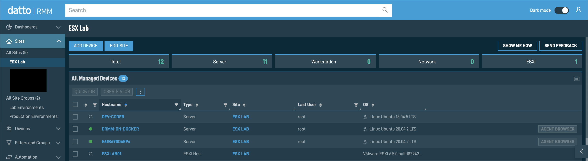
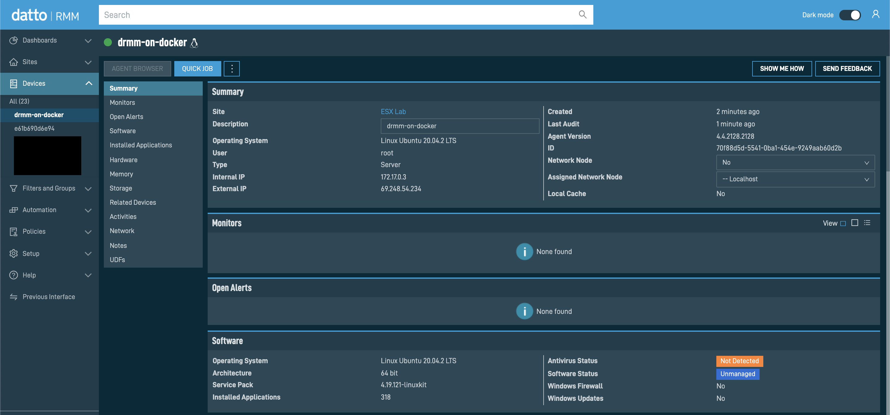
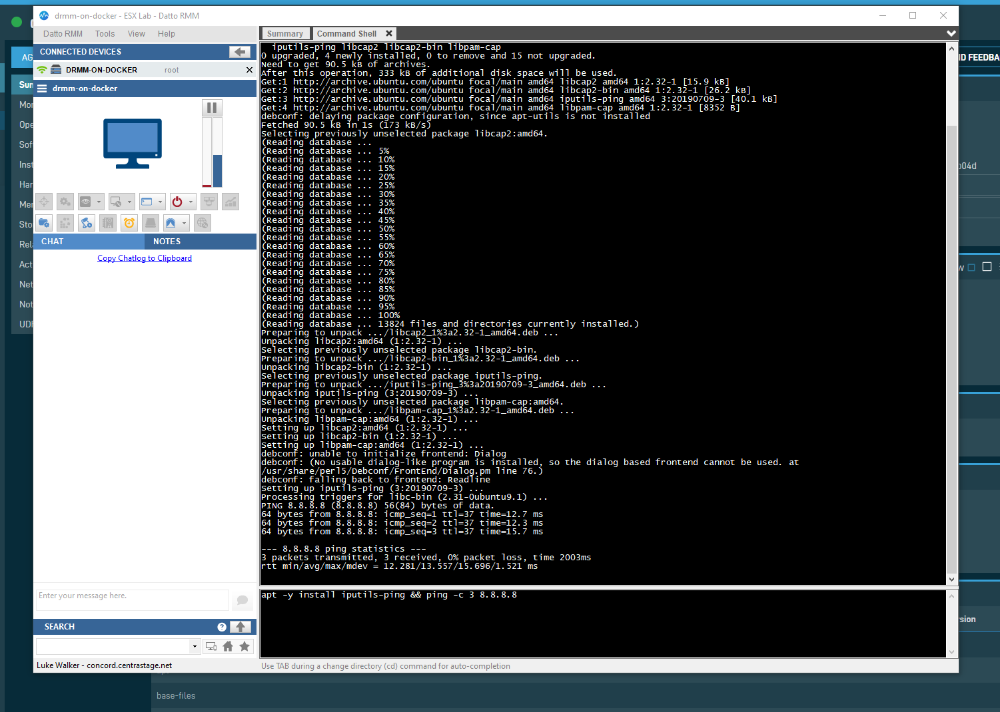

# Experiment: Containerized Datto RMM Agent

Usually the Datto RMM agent is used to manage an endpoint, like a desktop or laptop.  However, in cases where you need a point of presence on the network, or can deploy only containers to an appliance and want to execute network checks against that appliance or other nodes, then containerizing the agent can potentially be useful.

This is an unsupported build that takes the standard Datto RMM agent, and helps you deploy it against a docker environment.

It only requires one environment variable - the Datto RMM site ID - which can be obtained from your admin portal.

## What works

1. Job execution
2. Agent Browser functions

## What doesn't

* OS monitoring via Agent will only return info from the container environment, and is not reflective of the real host. 

## Building the docker container

As Docker Hub has recently changed their rules around container registry storage, you will need to build and self-publish the image.

To build the container, simply clone and run docker build.

```bash
git clone https://github.com/ozskywalker/drmm-agent
cd drmm-docker
docker build -t ozskywalker/drmm-agent .
```

## Obtaining your Datto RMM Site ID

1. Login to your Datto RMM portal (https://login.datto.com/)
2. Select the site in which you want to install your containerized agent
3. Go to "ADD DEVICE"
4. Grab the download link for the linux agent
5. Extract the GUID from the download link.

NB: GUIDs typically look like `4bd37199-1793-47be-bf07-cb0ca7a60631`

## Running the container

A few brief notes:

* Only one parameter is required - the Site ID - which you can pass viaa the DRMMSITE environ parameter.
* A TTY session is required for the container to operate successfully.
* If the container is killed and subsequently restarted, there is a possiblity that it may  uninstall itself on the next pass, then on the subsequent startup install again and appear as a brand new device within your Datto RMM site.   By using a restart value of 'always' will ensure it will self-reinstall successfully, however you will need to manually remove the old instance of the agent.

### From CLI (Docker):

```bash
docker run -dtP -h "drmm-on-docker" --restart always -e DRMMSITE=aaaaaaaa-bbbb-cccc-dddd-eeeeeeeeeeee ozskywalker/drmm-agent
```

## Logs

The installation and activation of the agent, and logs are sent to the container logs.

Simply run `docker logs` to gain a historic and real-time view as to what is happening within the container.

# Contributions and Support

If you wish to contribute, please fork and submit a PR request.

Issues can be lodged, however as no warranty or support is provided with this deployment, any assistance is best effort at best.

## Screenshots




